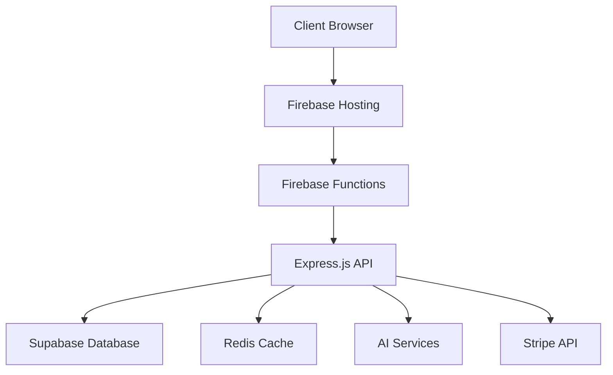
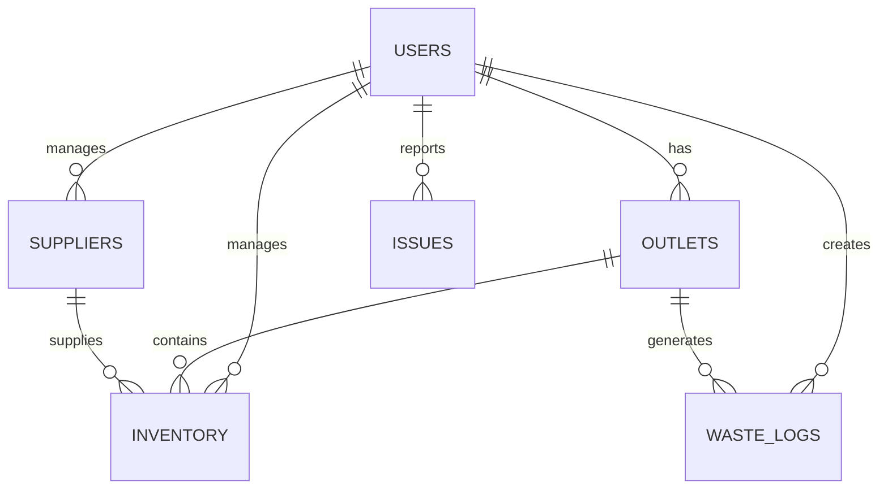

# WasteWise SaaS Platform - Technical Specification Document (TSD)

## Document Information
- **Document Version**: 1.0
- **Last Updated**: December 2024
- **Document Owner**: Engineering Team
- **Stakeholders**: Development, DevOps, QA, Architecture

---

## 1. System Architecture Overview

### 1.1 High-Level Architecture
```
┌─────────────────────────────────────────────────────────────────┐
│                        Client Layer                             │
├─────────────────────────────────────────────────────────────────┤
│  React Frontend (TypeScript) │ Mobile App (Future) │ API Clients │
└─────────────────────────────────────────────────────────────────┘
                                │
                                ▼
┌─────────────────────────────────────────────────────────────────┐
│                      Presentation Layer                         │
├─────────────────────────────────────────────────────────────────┤
│  Firebase Hosting │ CDN │ Load Balancer │ SSL/TLS Termination  │
└─────────────────────────────────────────────────────────────────┘
                                │
                                ▼
┌─────────────────────────────────────────────────────────────────┐
│                      Application Layer                          │
├─────────────────────────────────────────────────────────────────┤
│  Firebase Functions │ Express.js API │ Authentication │ Rate Limiting │
└─────────────────────────────────────────────────────────────────┘
                                │
                                ▼
┌─────────────────────────────────────────────────────────────────┐
│                       Service Layer                             │
├─────────────────────────────────────────────────────────────────┤
│  AI Services │ Payment Processing │ Email Service │ File Storage │
└─────────────────────────────────────────────────────────────────┘
                                │
                                ▼
┌─────────────────────────────────────────────────────────────────┐
│                       Data Layer                                │
├─────────────────────────────────────────────────────────────────┤
│  Supabase (PostgreSQL) │ Redis Cache │ File Storage │ Logs │
└─────────────────────────────────────────────────────────────────┘
```

### 1.2 Technology Stack Details

#### Frontend Stack
- **Framework**: React 18 with TypeScript
- **Build Tool**: Vite 5.x
- **Styling**: Tailwind CSS 3.x
- **State Management**: React Context + Custom Hooks
- **Routing**: React Router DOM 6.x
- **HTTP Client**: Fetch API with custom wrapper
- **UI Components**: Custom components + Lucide React icons
- **Forms**: React Hook Form + Zod validation
- **Animations**: Framer Motion
- **Charts**: Recharts
- **Notifications**: React Hot Toast

#### Backend Stack
- **Runtime**: Node.js 18.x
- **Framework**: Express.js 4.x
- **Language**: JavaScript (ES6+)
- **Authentication**: Supabase Auth + JWT
- **Database**: Supabase (PostgreSQL 15)
- **Caching**: Redis (via ioredis)
- **File Upload**: Multer
- **Email**: Nodemailer
- **Validation**: Express Validator
- **Security**: Helmet, CORS, Rate Limiting
- **Logging**: Custom logger with Winston

#### Infrastructure Stack
- **Hosting**: Firebase Hosting
- **Functions**: Firebase Cloud Functions
- **Database**: Supabase (PostgreSQL)
- **Storage**: Supabase Storage
- **CDN**: Firebase CDN
- **CI/CD**: Jenkins
- **Monitoring**: Custom monitoring scripts

#### Third-Party Services
- **Authentication**: Supabase Auth
- **Payments**: Stripe
- **AI Services**: Google Gemini, OpenAI ChatGPT
- **Email**: Supabase Auth (email templates)
- **Analytics**: Custom implementation

---

## 2. Database Design

### 2.1 Database Schema

#### Core Tables

**users**
```sql
CREATE TABLE users (
    id UUID PRIMARY KEY DEFAULT uuid_generate_v4(),
    email TEXT UNIQUE NOT NULL,
    first_name TEXT,
    last_name TEXT,
    company_name TEXT,
    company_size TEXT,
    primary_pain TEXT,
    phone_number TEXT,
    business_type TEXT DEFAULT 'restaurant',
    locations INTEGER DEFAULT 1,
    annual_revenue TEXT DEFAULT 'under_100k',
    primary_goals TEXT[],
    data_sources TEXT[],
    team_size TEXT DEFAULT '1-10',
    timezone TEXT DEFAULT 'Asia/Kuala_Lumpur',
    trial_start TIMESTAMP WITH TIME ZONE,
    trial_end TIMESTAMP WITH TIME ZONE,
    subscription_status TEXT DEFAULT 'trial',
    subscription_plan TEXT DEFAULT 'free',
    created_at TIMESTAMP WITH TIME ZONE DEFAULT NOW(),
    updated_at TIMESTAMP WITH TIME ZONE DEFAULT NOW()
);
```

**outlets**
```sql
CREATE TABLE outlets (
    id UUID PRIMARY KEY DEFAULT uuid_generate_v4(),
    user_id UUID REFERENCES auth.users(id) ON DELETE CASCADE,
    outlet_name TEXT NOT NULL,
    address TEXT,
    city TEXT,
    state TEXT,
    country TEXT DEFAULT 'Malaysia',
    postal_code TEXT,
    phone TEXT,
    email TEXT,
    manager_name TEXT,
    capacity INTEGER,
    opening_hours JSONB,
    is_active BOOLEAN DEFAULT true,
    created_at TIMESTAMP WITH TIME ZONE DEFAULT NOW(),
    updated_at TIMESTAMP WITH TIME ZONE DEFAULT NOW()
);
```

**inventory**
```sql
CREATE TABLE inventory (
    id UUID PRIMARY KEY DEFAULT uuid_generate_v4(),
    user_id UUID REFERENCES auth.users(id) ON DELETE CASCADE,
    outlet_id UUID REFERENCES outlets(id) ON DELETE SET NULL,
    item_name TEXT NOT NULL,
    category TEXT,
    unit TEXT,
    current_stock DECIMAL(10,2) DEFAULT 0,
    min_stock DECIMAL(10,2) DEFAULT 0,
    max_stock DECIMAL(10,2) DEFAULT 0,
    cost_per_unit DECIMAL(10,2),
    supplier_id UUID REFERENCES suppliers(id),
    expiry_date DATE,
    is_active BOOLEAN DEFAULT true,
    created_at TIMESTAMP WITH TIME ZONE DEFAULT NOW(),
    updated_at TIMESTAMP WITH TIME ZONE DEFAULT NOW()
);
```

**waste_logs**
```sql
CREATE TABLE waste_logs (
    id UUID PRIMARY KEY DEFAULT uuid_generate_v4(),
    user_id UUID REFERENCES auth.users(id) ON DELETE CASCADE,
    outlet_id UUID REFERENCES outlets(id) ON DELETE SET NULL,
    date DATE NOT NULL,
    waste_type TEXT NOT NULL,
    quantity DECIMAL(10,2) NOT NULL,
    unit TEXT NOT NULL,
    cost DECIMAL(10,2),
    reason TEXT,
    notes TEXT,
    created_at TIMESTAMP WITH TIME ZONE DEFAULT NOW(),
    updated_at TIMESTAMP WITH TIME ZONE DEFAULT NOW()
);
```

**suppliers**
```sql
CREATE TABLE suppliers (
    id UUID PRIMARY KEY DEFAULT uuid_generate_v4(),
    user_id UUID REFERENCES auth.users(id) ON DELETE CASCADE,
    supplier_name TEXT NOT NULL,
    contact_person TEXT,
    email TEXT,
    phone TEXT,
    address TEXT,
    city TEXT,
    state TEXT,
    country TEXT DEFAULT 'Malaysia',
    postal_code TEXT,
    payment_terms TEXT,
    is_active BOOLEAN DEFAULT true,
    created_at TIMESTAMP WITH TIME ZONE DEFAULT NOW(),
    updated_at TIMESTAMP WITH TIME ZONE DEFAULT NOW()
);
```

**subscriptions**
```sql
CREATE TABLE subscriptions (
    id UUID PRIMARY KEY DEFAULT uuid_generate_v4(),
    user_id UUID REFERENCES auth.users(id) ON DELETE CASCADE,
    plan_id TEXT NOT NULL,
    status TEXT NOT NULL,
    stripe_customer_id TEXT,
    stripe_subscription_id TEXT,
    stripe_payment_intent_id TEXT,
    amount INTEGER,
    currency TEXT DEFAULT 'usd',
    trial_start TIMESTAMP WITH TIME ZONE,
    trial_end TIMESTAMP WITH TIME ZONE,
    current_period_start TIMESTAMP WITH TIME ZONE,
    current_period_end TIMESTAMP WITH TIME ZONE,
    created_at TIMESTAMP WITH TIME ZONE DEFAULT NOW(),
    updated_at TIMESTAMP WITH TIME ZONE DEFAULT NOW()
);
```

#### Issue Reporting Tables

**issue_categories**
```sql
CREATE TABLE issue_categories (
    id UUID PRIMARY KEY DEFAULT uuid_generate_v4(),
    name TEXT UNIQUE NOT NULL,
    description TEXT,
    icon TEXT,
    color TEXT DEFAULT '#3B82F6',
    is_active BOOLEAN DEFAULT true,
    sort_order INTEGER DEFAULT 0,
    created_at TIMESTAMP WITH TIME ZONE DEFAULT NOW(),
    updated_at TIMESTAMP WITH TIME ZONE DEFAULT NOW()
);
```

**issue_priorities**
```sql
CREATE TABLE issue_priorities (
    id UUID PRIMARY KEY DEFAULT uuid_generate_v4(),
    name TEXT UNIQUE NOT NULL,
    description TEXT,
    color TEXT NOT NULL,
    sort_order INTEGER DEFAULT 0,
    sla_hours INTEGER,
    created_at TIMESTAMP WITH TIME ZONE DEFAULT NOW(),
    updated_at TIMESTAMP WITH TIME ZONE DEFAULT NOW()
);
```

**issue_statuses**
```sql
CREATE TABLE issue_statuses (
    id UUID PRIMARY KEY DEFAULT uuid_generate_v4(),
    name TEXT UNIQUE NOT NULL,
    description TEXT,
    color TEXT NOT NULL,
    is_final BOOLEAN DEFAULT false,
    sort_order INTEGER DEFAULT 0,
    created_at TIMESTAMP WITH TIME ZONE DEFAULT NOW(),
    updated_at TIMESTAMP WITH TIME ZONE DEFAULT NOW()
);
```

**issues**
```sql
CREATE TABLE issues (
    id UUID PRIMARY KEY DEFAULT uuid_generate_v4(),
    user_id UUID REFERENCES auth.users(id) ON DELETE CASCADE,
    outlet_id UUID REFERENCES outlets(id) ON DELETE SET NULL,
    title TEXT NOT NULL,
    description TEXT NOT NULL,
    category_id UUID REFERENCES issue_categories(id),
    priority_id UUID REFERENCES issue_priorities(id),
    status_id UUID REFERENCES issue_statuses(id),
    browser_info JSONB,
    device_info JSONB,
    page_url TEXT,
    user_agent TEXT,
    screen_resolution TEXT,
    attachments JSONB DEFAULT '[]',
    internal_notes TEXT,
    assigned_to UUID REFERENCES auth.users(id),
    estimated_resolution_date TIMESTAMP WITH TIME ZONE,
    actual_resolution_date TIMESTAMP WITH TIME ZONE,
    created_at TIMESTAMP WITH TIME ZONE DEFAULT NOW(),
    updated_at TIMESTAMP WITH TIME ZONE DEFAULT NOW(),
    resolved_at TIMESTAMP WITH TIME ZONE,
    closed_at TIMESTAMP WITH TIME ZONE
);
```

### 2.2 Indexes and Performance

#### Primary Indexes
```sql
-- Users
CREATE INDEX idx_users_email ON users(email);
CREATE INDEX idx_users_subscription_status ON users(subscription_status);
CREATE INDEX idx_users_trial_end ON users(trial_end);

-- Outlets
CREATE INDEX idx_outlets_user_id ON outlets(user_id);
CREATE INDEX idx_outlets_active ON outlets(is_active);

-- Inventory
CREATE INDEX idx_inventory_user_id ON inventory(user_id);
CREATE INDEX idx_inventory_outlet_id ON inventory(outlet_id);
CREATE INDEX idx_inventory_category ON inventory(category);
CREATE INDEX idx_inventory_expiry ON inventory(expiry_date);

-- Waste Logs
CREATE INDEX idx_waste_logs_user_id ON waste_logs(user_id);
CREATE INDEX idx_waste_logs_date ON waste_logs(date);
CREATE INDEX idx_waste_logs_type ON waste_logs(waste_type);

-- Issues
CREATE INDEX idx_issues_user_id ON issues(user_id);
CREATE INDEX idx_issues_status_id ON issues(status_id);
CREATE INDEX idx_issues_priority_id ON issues(priority_id);
CREATE INDEX idx_issues_created_at ON issues(created_at);
```

### 2.3 Row Level Security (RLS)

#### RLS Policies
```sql
-- Enable RLS on all tables
ALTER TABLE users ENABLE ROW LEVEL SECURITY;
ALTER TABLE outlets ENABLE ROW LEVEL SECURITY;
ALTER TABLE inventory ENABLE ROW LEVEL SECURITY;
ALTER TABLE waste_logs ENABLE ROW LEVEL SECURITY;
ALTER TABLE suppliers ENABLE ROW LEVEL SECURITY;
ALTER TABLE subscriptions ENABLE ROW LEVEL SECURITY;

-- User policies
CREATE POLICY "Users can view own data" ON users FOR SELECT USING (auth.uid() = id);
CREATE POLICY "Users can update own data" ON users FOR UPDATE USING (auth.uid() = id);

-- Outlet policies
CREATE POLICY "Users can manage own outlets" ON outlets FOR ALL USING (auth.uid() = user_id);

-- Inventory policies
CREATE POLICY "Users can manage own inventory" ON inventory FOR ALL USING (auth.uid() = user_id);

-- Waste logs policies
CREATE POLICY "Users can manage own waste logs" ON waste_logs FOR ALL USING (auth.uid() = user_id);

-- Supplier policies
CREATE POLICY "Users can manage own suppliers" ON suppliers FOR ALL USING (auth.uid() = user_id);

-- Subscription policies
CREATE POLICY "Users can view own subscriptions" ON subscriptions FOR SELECT USING (auth.uid() = user_id);
```

---

## 3. API Design

### 3.1 RESTful API Endpoints

#### Authentication Endpoints
```
POST   /api/auth/signup
POST   /api/auth/login
POST   /api/auth/logout
POST   /api/auth/google/callback
POST   /api/auth/create-profile
GET    /api/auth/profile/check/:userId
POST   /api/auth/refresh-token
```

#### User Management Endpoints
```
GET    /api/user/profile
PUT    /api/user/profile
GET    /api/user/outlets
POST   /api/user/outlets
PUT    /api/user/outlets/:id
DELETE /api/user/outlets/:id
```

#### Inventory Management Endpoints
```
GET    /api/inventory
POST   /api/inventory
PUT    /api/inventory/:id
DELETE /api/inventory/:id
GET    /api/inventory/categories
GET    /api/inventory/analytics
POST   /api/inventory/import
GET    /api/inventory/export
```

#### Waste Tracking Endpoints
```
GET    /api/waste
POST   /api/waste
PUT    /api/waste/:id
DELETE /api/waste/:id
GET    /api/waste/analytics
GET    /api/waste/reports
POST   /api/waste/bulk-import
```

#### AI Recommendations Endpoints
```
GET    /api/ai/recommendations
POST   /api/ai/chat
GET    /api/ai/forecast
POST   /api/ai/analyze
```

#### Issue Reporting Endpoints
```
GET    /api/issues
POST   /api/issues
GET    /api/issues/:id
PUT    /api/issues/:id
DELETE /api/issues/:id
POST   /api/issues/:id/comments
GET    /api/issues/:id/history
GET    /api/issues/stats/overview
GET    /api/issues/categories
GET    /api/issues/priorities
GET    /api/issues/statuses
GET    /api/issues/templates
GET    /api/issues/outlets
POST   /api/issues/:id/attachments
```

#### Billing Endpoints
```
GET    /api/billing/subscription
POST   /api/billing/create-payment-intent
POST   /api/billing/webhook
GET    /api/billing/invoices
POST   /api/billing/cancel
POST   /api/billing/upgrade
```

### 3.2 API Response Format

#### Success Response
```json
{
  "success": true,
  "data": {
    // Response data
  },
  "message": "Operation completed successfully",
  "timestamp": "2024-12-19T10:30:00Z"
}
```

#### Error Response
```json
{
  "success": false,
  "error": {
    "code": "VALIDATION_ERROR",
    "message": "Invalid input data",
    "details": {
      "field": "email",
      "issue": "Email is required"
    }
  },
  "timestamp": "2024-12-19T10:30:00Z"
}
```

### 3.3 Authentication & Authorization

#### JWT Token Structure
```json
{
  "header": {
    "alg": "HS256",
    "typ": "JWT"
  },
  "payload": {
    "sub": "user-uuid",
    "email": "user@example.com",
    "iat": 1702989000,
    "exp": 1703075400,
    "iss": "wastewise-api"
  }
}
```

#### Authorization Headers
```
Authorization: Bearer <jwt-token>
X-API-Key: <api-key> (for service-to-service)
```

---

## 4. Frontend Architecture

### 4.1 Component Structure

```
src/
├── components/
│   ├── Auth/
│   │   ├── Login.tsx
│   │   ├── Signup.tsx
│   │   ├── OnboardingForm.tsx
│   │   ├── EmailConfirmation.tsx
│   │   └── TrialEnded.tsx
│   ├── Marketing/
│   │   ├── LandingPage.tsx
│   │   ├── PricingPage.tsx
│   │   └── GrandSlamOffer.tsx
│   ├── UI/
│   │   ├── Dashboard.tsx
│   │   ├── InventoryManager.tsx
│   │   ├── WasteTracking.tsx
│   │   ├── DemandForecasting.tsx
│   │   ├── MenuOptimization.tsx
│   │   ├── StaffTraining.tsx
│   │   ├── SupplierManager.tsx
│   │   ├── ReportsCompliance.tsx
│   │   ├── LLMRecommendations.tsx
│   │   ├── IssueReporting.tsx
│   │   ├── UserSettings.tsx
│   │   ├── SubscriptionManager.tsx
│   │   ├── PaymentModal.tsx
│   │   ├── AddInventoryModal.tsx
│   │   ├── IdleWarning.tsx
│   │   └── RichTextDemo.tsx
│   └── Checkout/
│       ├── CheckoutPage.tsx
│       └── CheckoutSuccess.tsx
├── services/
│   ├── api.ts
│   ├── inventorySocket.ts
│   └── llmService.ts
├── hooks/
│   └── useIdleLogout.ts
├── utils/
│   ├── auth.ts
│   ├── date.ts
│   ├── secureStorage.ts
│   ├── aiTextParser.tsx
│   └── enhancedAiTextParser.tsx
└── routes/
    └── PrivateRoute.tsx
```

### 4.2 State Management

#### Context Providers
```typescript
// AuthContext
interface AuthContextType {
  user: User | null;
  loading: boolean;
  signIn: (email: string, password: string) => Promise<void>;
  signUp: (userData: SignUpData) => Promise<void>;
  signOut: () => Promise<void>;
  updateProfile: (data: Partial<User>) => Promise<void>;
}

// AppContext
interface AppContextType {
  theme: 'light' | 'dark';
  toggleTheme: () => void;
  notifications: Notification[];
  addNotification: (notification: Notification) => void;
  removeNotification: (id: string) => void;
}
```

#### Custom Hooks
```typescript
// useAuth
const useAuth = () => {
  const [user, setUser] = useState<User | null>(null);
  const [loading, setLoading] = useState(true);
  
  // Authentication logic
  return { user, loading, signIn, signUp, signOut };
};

// useApi
const useApi = () => {
  const [loading, setLoading] = useState(false);
  const [error, setError] = useState<string | null>(null);
  
  const request = async (endpoint: string, options?: RequestInit) => {
    // API request logic
  };
  
  return { loading, error, request };
};
```

### 4.3 Routing Configuration

#### Route Structure
```typescript
const routes = [
  // Public routes
  { path: '/', element: <LandingPage /> },
  { path: '/pricing', element: <PricingPage /> },
  { path: '/checkout', element: <CheckoutPage /> },
  { path: '/signup', element: <Signup /> },
  { path: '/login', element: <Login /> },
  { path: '/email-confirmation', element: <EmailConfirmation /> },
  
  // Protected routes
  { 
    path: '/dashboard', 
    element: <RequireAuth><AuthenticatedLayout><Dashboard /></AuthenticatedLayout></RequireAuth> 
  },
  { 
    path: '/inventory', 
    element: <RequireAuth><AuthenticatedLayout><InventoryManager /></AuthenticatedLayout></RequireAuth> 
  },
  // ... other protected routes
];
```

---

## 5. Security Implementation

### 5.1 Authentication Security

#### Password Security
```javascript
// Password hashing (handled by Supabase)
const { data, error } = await supabase.auth.signUp({
  email: email,
  password: password, // Automatically hashed by Supabase
  options: {
    data: userMetadata
  }
});
```

#### JWT Security
```javascript
// JWT verification middleware
const verifyToken = (req, res, next) => {
  const token = req.headers.authorization?.split(' ')[1];
  
  if (!token) {
    return res.status(401).json({ error: 'No token provided' });
  }
  
  try {
    const decoded = jwt.verify(token, process.env.JWT_SECRET);
    req.user = decoded;
    next();
  } catch (error) {
    return res.status(401).json({ error: 'Invalid token' });
  }
};
```

### 5.2 API Security

#### Rate Limiting
```javascript
const rateLimit = require('express-rate-limit');

const apiLimiter = rateLimit({
  windowMs: 15 * 60 * 1000, // 15 minutes
  max: 100, // limit each IP to 100 requests per windowMs
  message: {
    error: 'Too many requests from this IP, please try again later.',
    retryAfter: '15 minutes'
  },
  standardHeaders: true,
  legacyHeaders: false
});

app.use('/api/', apiLimiter);
```

#### CORS Configuration
```javascript
const cors = require('cors');

app.use(cors({
  origin: [
    'https://wastewise-30.web.app',
    'https://wastewise-30.firebaseapp.com',
    'http://localhost:5000',
    'http://localhost:5173'
  ],
  credentials: true,
  methods: ['GET', 'POST', 'PUT', 'DELETE', 'OPTIONS'],
  allowedHeaders: ['Content-Type', 'Authorization', 'X-Requested-With']
}));
```

#### Security Headers
```javascript
const helmet = require('helmet');

app.use(helmet({
  contentSecurityPolicy: {
    directives: {
      defaultSrc: ["'self'"],
      styleSrc: ["'self'", "'unsafe-inline'", "https://fonts.googleapis.com"],
      fontSrc: ["'self'", "https://fonts.gstatic.com"],
      imgSrc: ["'self'", "data:", "https:"],
      scriptSrc: ["'self'"],
      connectSrc: ["'self'", "https://*.supabase.co", "https://api.openai.com", "https://generativelanguage.googleapis.com"]
    }
  },
  crossOriginEmbedderPolicy: false
}));
```

### 5.3 Data Security

#### Input Validation
```javascript
const { body, validationResult } = require('express-validator');

const validateUserRegistration = [
  body('email').isEmail().normalizeEmail(),
  body('password').isLength({ min: 8 }).matches(/^(?=.*[a-z])(?=.*[A-Z])(?=.*\d)/),
  body('company_name').trim().isLength({ min: 2, max: 100 }),
  (req, res, next) => {
    const errors = validationResult(req);
    if (!errors.isEmpty()) {
      return res.status(400).json({ errors: errors.array() });
    }
    next();
  }
];
```

#### SQL Injection Prevention
```javascript
// Using parameterized queries (Supabase handles this automatically)
const { data, error } = await supabase
  .from('users')
  .select('*')
  .eq('email', email) // Parameterized query
  .single();
```

---

## 6. Performance Optimization

### 6.1 Frontend Performance

#### Code Splitting
```typescript
// Vite configuration for code splitting
export default defineConfig({
  build: {
    rollupOptions: {
      output: {
        manualChunks: {
          vendor: ['react', 'react-dom'],
          router: ['react-router-dom'],
          ui: ['lucide-react', 'framer-motion'],
          charts: ['recharts'],
          forms: ['react-hook-form', 'zod', '@hookform/resolvers']
        }
      }
    }
  }
});
```

#### Lazy Loading
```typescript
// Lazy load components
const Dashboard = lazy(() => import('./components/UI/Dashboard'));
const InventoryManager = lazy(() => import('./components/UI/InventoryManager'));

// Suspense wrapper
<Suspense fallback={<LoadingSpinner />}>
  <Dashboard />
</Suspense>
```

#### Caching Strategy
```typescript
// API response caching
const useCachedData = (key: string, fetcher: () => Promise<any>) => {
  const [data, setData] = useState(null);
  const [loading, setLoading] = useState(true);
  
  useEffect(() => {
    const cached = localStorage.getItem(key);
    if (cached) {
      setData(JSON.parse(cached));
      setLoading(false);
    } else {
      fetcher().then(result => {
        setData(result);
        localStorage.setItem(key, JSON.stringify(result));
        setLoading(false);
      });
    }
  }, [key, fetcher]);
  
  return { data, loading };
};
```

### 6.2 Backend Performance

#### Database Optimization
```sql
-- Query optimization
EXPLAIN ANALYZE SELECT 
  w.date,
  SUM(w.quantity) as total_waste,
  AVG(w.cost) as avg_cost
FROM waste_logs w
WHERE w.user_id = $1 
  AND w.date >= $2 
  AND w.date <= $3
GROUP BY w.date
ORDER BY w.date DESC;

-- Index optimization
CREATE INDEX CONCURRENTLY idx_waste_logs_user_date 
ON waste_logs(user_id, date DESC);
```

#### Caching Strategy
```javascript
// Redis caching
const redis = new Redis(process.env.REDIS_URL);

const getCachedData = async (key) => {
  const cached = await redis.get(key);
  if (cached) {
    return JSON.parse(cached);
  }
  return null;
};

const setCachedData = async (key, data, ttl = 3600) => {
  await redis.setex(key, ttl, JSON.stringify(data));
};
```

#### Connection Pooling
```javascript
// Database connection pooling (handled by Supabase)
const { createClient } = require('@supabase/supabase-js');

const supabase = createClient(
  process.env.SUPABASE_URL,
  process.env.SUPABASE_ANON_KEY,
  {
    auth: {
      autoRefreshToken: true,
      persistSession: true,
      detectSessionInUrl: true
    }
  }
);
```

---

## 7. Deployment & DevOps

### 7.1 Firebase Configuration

#### firebase.json
```json
{
  "hosting": {
    "public": "frontend/dist",
    "ignore": [
      "firebase.json",
      "**/.*",
      "**/node_modules/**",
      "**/*.map"
    ],
    "rewrites": [
      { "source": "/api/**", "function": "api" },
      { "source": "**", "destination": "/index.html" }
    ],
    "headers": [
      {
        "source": "**/*.@(js|css)",
        "headers": [
          { "key": "Cache-Control", "value": "public, max-age=31536000, immutable" },
          { "key": "X-Content-Type-Options", "value": "nosniff" }
        ]
      },
      {
        "source": "**",
        "headers": [
          { "key": "X-Frame-Options", "value": "DENY" },
          { "key": "X-XSS-Protection", "value": "1; mode=block" },
          { "key": "Referrer-Policy", "value": "strict-origin-when-cross-origin" },
          { "key": "Permissions-Policy", "value": "camera=(), microphone=(), geolocation=()" }
        ]
      }
    ],
    "cleanUrls": true,
    "trailingSlash": false
  },
  "functions": {
    "source": "backend",
    "runtime": "nodejs18",
    "codebase": "default",
    "ignore": [
      "node_modules", ".git", ".firebase", "*.log", "*.test.js", "*.spec.js", "coverage", ".env*", "*.md"
    ]
  }
}
```

### 7.2 CI/CD Pipeline

#### Jenkins Pipeline
```groovy
pipeline {
    agent any
    
    environment {
        NODE_VERSION = '18'
        FIREBASE_PROJECT = 'wastewise-30'
    }
    
    stages {
        stage('Checkout') {
            steps {
                checkout scm
            }
        }
        
        stage('Install Dependencies') {
            steps {
                sh 'npm ci'
                dir('frontend') {
                    sh 'npm ci'
                }
                dir('backend') {
                    sh 'npm ci'
                }
            }
        }
        
        stage('Run Tests') {
            steps {
                sh 'npm test'
                dir('frontend') {
                    sh 'npm run test'
                }
                dir('backend') {
                    sh 'npm test'
                }
            }
        }
        
        stage('Build Frontend') {
            steps {
                dir('frontend') {
                    sh 'npm run build'
                }
            }
        }
        
        stage('Deploy to Firebase') {
            steps {
                withCredentials([string(credentialsId: 'FIREBASE_TOKEN', variable: 'FIREBASE_TOKEN')]) {
                    sh 'firebase deploy --token $FIREBASE_TOKEN --project $FIREBASE_PROJECT'
                }
            }
        }
    }
    
    post {
        always {
            cleanWs()
        }
        success {
            echo 'Deployment successful!'
        }
        failure {
            echo 'Deployment failed!'
        }
    }
}
```

### 7.3 Environment Management

#### Environment Variables
```bash
# Frontend (.env)
VITE_SUPABASE_URL=https://your-project.supabase.co
VITE_SUPABASE_ANON_KEY=your-anon-key
VITE_API_URL=https://your-project.web.app
VITE_TRIAL_PERIOD_DAYS=30

# Backend (.env)
NODE_ENV=production
PORT=3000
SUPABASE_URL=https://your-project.supabase.co
SUPABASE_SERVICE_ROLE_KEY=your-service-role-key
JWT_SECRET=your-jwt-secret
STRIPE_SECRET_KEY=your-stripe-secret-key
STRIPE_WEBHOOK_SECRET=your-webhook-secret
GOOGLE_GEMINI_API_KEY=your-gemini-key
OPENAI_API_KEY=your-openai-key
REDIS_URL=your-redis-url
```

#### Firebase Functions Config
```bash
# Set environment variables for Firebase Functions
firebase functions:config:set \
  supabase.url="https://your-project.supabase.co" \
  supabase.service_role_key="your-service-role-key" \
  stripe.secret_key="your-stripe-secret-key" \
  stripe.webhook_secret="your-webhook-secret" \
  google.gemini_api_key="your-gemini-key" \
  openai.api_key="your-openai-key"
```

---

## 8. Monitoring & Logging

### 8.1 Application Monitoring

#### Error Tracking
```javascript
// Custom error logger
const logger = {
  error: (message, error, context = {}) => {
    console.error(`[ERROR] ${message}`, {
      error: error.message,
      stack: error.stack,
      context,
      timestamp: new Date().toISOString()
    });
    
    // Send to external monitoring service
    if (process.env.NODE_ENV === 'production') {
      // Send to monitoring service
    }
  },
  
  info: (message, data = {}) => {
    console.log(`[INFO] ${message}`, {
      ...data,
      timestamp: new Date().toISOString()
    });
  },
  
  warn: (message, data = {}) => {
    console.warn(`[WARN] ${message}`, {
      ...data,
      timestamp: new Date().toISOString()
    });
  }
};
```

#### Performance Monitoring
```javascript
// API response time monitoring
app.use((req, res, next) => {
  const start = Date.now();
  
  res.on('finish', () => {
    const duration = Date.now() - start;
    logger.info('API Request', {
      method: req.method,
      url: req.url,
      status: res.statusCode,
      duration: `${duration}ms`,
      userAgent: req.get('User-Agent')
    });
  });
  
  next();
});
```

### 8.2 Health Checks

#### Health Check Endpoint
```javascript
app.get('/health', (req, res) => {
  const health = {
    status: 'healthy',
    timestamp: new Date().toISOString(),
    environment: process.env.NODE_ENV,
    version: process.env.npm_package_version || '1.0.0',
    services: {
      database: 'connected',
      redis: 'connected',
      stripe: 'connected'
    }
  };
  
  res.json(health);
});
```

#### Database Health Check
```javascript
const checkDatabaseHealth = async () => {
  try {
    const { data, error } = await supabase
      .from('users')
      .select('count')
      .limit(1);
    
    if (error) throw error;
    return { status: 'healthy', responseTime: Date.now() - start };
  } catch (error) {
    return { status: 'unhealthy', error: error.message };
  }
};
```

---

## 9. Testing Strategy

### 9.1 Unit Testing

#### Frontend Tests
```typescript
// Component testing with React Testing Library
import { render, screen, fireEvent } from '@testing-library/react';
import { Login } from '../Login';

describe('Login Component', () => {
  test('renders login form', () => {
    render(<Login />);
    expect(screen.getByLabelText(/email/i)).toBeInTheDocument();
    expect(screen.getByLabelText(/password/i)).toBeInTheDocument();
    expect(screen.getByRole('button', { name: /sign in/i })).toBeInTheDocument();
  });
  
  test('handles form submission', async () => {
    const mockSignIn = jest.fn();
    render(<Login onSignIn={mockSignIn} />);
    
    fireEvent.change(screen.getByLabelText(/email/i), {
      target: { value: 'test@example.com' }
    });
    fireEvent.change(screen.getByLabelText(/password/i), {
      target: { value: 'password123' }
    });
    fireEvent.click(screen.getByRole('button', { name: /sign in/i }));
    
    expect(mockSignIn).toHaveBeenCalledWith({
      email: 'test@example.com',
      password: 'password123'
    });
  });
});
```

#### Backend Tests
```javascript
// API endpoint testing with Jest and Supertest
const request = require('supertest');
const app = require('../app');

describe('Auth API', () => {
  test('POST /api/auth/signup - creates new user', async () => {
    const userData = {
      email: 'test@example.com',
      password: 'password123',
      company_name: 'Test Company'
    };
    
    const response = await request(app)
      .post('/api/auth/signup')
      .send(userData)
      .expect(201);
    
    expect(response.body.success).toBe(true);
    expect(response.body.data.email).toBe(userData.email);
  });
  
  test('POST /api/auth/login - authenticates user', async () => {
    const credentials = {
      email: 'test@example.com',
      password: 'password123'
    };
    
    const response = await request(app)
      .post('/api/auth/login')
      .send(credentials)
      .expect(200);
    
    expect(response.body.success).toBe(true);
    expect(response.body.data.token).toBeDefined();
  });
});
```

### 9.2 Integration Testing

#### API Integration Tests
```javascript
// End-to-end API testing
describe('Inventory Management', () => {
  let authToken;
  let userId;
  
  beforeAll(async () => {
    // Setup test user and get auth token
    const signupResponse = await request(app)
      .post('/api/auth/signup')
      .send(testUserData);
    
    authToken = signupResponse.body.data.token;
    userId = signupResponse.body.data.user.id;
  });
  
  test('Complete inventory workflow', async () => {
    // Create inventory item
    const createResponse = await request(app)
      .post('/api/inventory')
      .set('Authorization', `Bearer ${authToken}`)
      .send(inventoryData)
      .expect(201);
    
    const itemId = createResponse.body.data.id;
    
    // Get inventory list
    const listResponse = await request(app)
      .get('/api/inventory')
      .set('Authorization', `Bearer ${authToken}`)
      .expect(200);
    
    expect(listResponse.body.data).toHaveLength(1);
    
    // Update inventory item
    await request(app)
      .put(`/api/inventory/${itemId}`)
      .set('Authorization', `Bearer ${authToken}`)
      .send({ current_stock: 50 })
      .expect(200);
    
    // Delete inventory item
    await request(app)
      .delete(`/api/inventory/${itemId}`)
      .set('Authorization', `Bearer ${authToken}`)
      .expect(200);
  });
});
```

### 9.3 Performance Testing

#### Load Testing
```javascript
// Load testing with Artillery
const { check } = require('k6');
const http = require('k6/http');

export const options = {
  stages: [
    { duration: '2m', target: 100 }, // Ramp up
    { duration: '5m', target: 100 }, // Stay at 100 users
    { duration: '2m', target: 0 },   // Ramp down
  ],
  thresholds: {
    http_req_duration: ['p(95)<500'], // 95% of requests must complete below 500ms
    http_req_failed: ['rate<0.1'],    // Error rate must be below 10%
  },
};

export default function() {
  const response = http.get('https://wastewise-30.web.app/api/health');
  
  check(response, {
    'status is 200': (r) => r.status === 200,
    'response time < 500ms': (r) => r.timings.duration < 500,
  });
}
```

---

## 10. Documentation Standards

### 10.1 Code Documentation

#### JSDoc Comments
```javascript
/**
 * Creates a new user profile in the database
 * @param {string} userId - The user's unique identifier
 * @param {Object} userData - User profile data
 * @param {string} userData.email - User's email address
 * @param {string} userData.first_name - User's first name
 * @param {string} userData.last_name - User's last name
 * @param {string} userData.company_name - Company name
 * @param {string} userData.company_size - Company size category
 * @returns {Promise<Object>} Created user profile data
 * @throws {Error} When profile creation fails
 */
async function createUserProfile(userId, userData) {
  // Implementation
}
```

#### API Documentation
```javascript
/**
 * @api {post} /api/auth/signup Create new user account
 * @apiName SignUp
 * @apiGroup Authentication
 * @apiVersion 1.0.0
 *
 * @apiParam {String} email User's email address
 * @apiParam {String} password User's password (min 8 chars)
 * @apiParam {String} company_name Company name
 * @apiParam {String} [company_size] Company size category
 *
 * @apiSuccess {Boolean} success Success status
 * @apiSuccess {Object} data User data
 * @apiSuccess {String} data.id User ID
 * @apiSuccess {String} data.email User email
 * @apiSuccess {String} data.token JWT token
 *
 * @apiError {Object} error Error object
 * @apiError {String} error.message Error message
 */
```

### 10.2 Architecture Documentation

#### System Diagrams


#### Database ERD


---

## 11. Maintenance & Support

### 11.1 Backup Strategy

#### Database Backups
```sql
-- Automated daily backups (handled by Supabase)
-- Manual backup script
pg_dump $DATABASE_URL > backup_$(date +%Y%m%d_%H%M%S).sql

-- Restore script
psql $DATABASE_URL < backup_20241219_143000.sql
```

#### File Storage Backups
```javascript
// Automated file backup to cloud storage
const backupFiles = async () => {
  const { data: files } = await supabase.storage
    .from('uploads')
    .list();
  
  // Copy to backup bucket
  for (const file of files) {
    await backupToCloudStorage(file);
  }
};
```

### 11.2 Monitoring & Alerts

#### System Monitoring
```javascript
// Health check monitoring
const monitorSystemHealth = async () => {
  const checks = [
    checkDatabaseConnection(),
    checkRedisConnection(),
    checkStripeAPI(),
    checkAIAPIs()
  ];
  
  const results = await Promise.allSettled(checks);
  const failures = results.filter(r => r.status === 'rejected');
  
  if (failures.length > 0) {
    await sendAlert('System health check failed', failures);
  }
};
```

#### Performance Monitoring
```javascript
// Performance metrics collection
const collectMetrics = () => {
  const metrics = {
    memory: process.memoryUsage(),
    cpu: process.cpuUsage(),
    uptime: process.uptime(),
    timestamp: Date.now()
  };
  
  // Send to monitoring service
  sendMetrics(metrics);
};
```

---

## 12. Future Technical Considerations

### 12.1 Scalability Planning

#### Horizontal Scaling
- **Database**: Implement read replicas and connection pooling
- **API**: Deploy multiple instances behind load balancer
- **Caching**: Implement distributed caching with Redis Cluster
- **CDN**: Expand global CDN coverage

#### Microservices Architecture
- **Auth Service**: Separate authentication service
- **AI Service**: Dedicated AI/ML service
- **Notification Service**: Real-time notification service
- **Analytics Service**: Data processing and analytics service

### 12.2 Technology Evolution

#### Framework Updates
- **React**: Plan migration to React 19
- **Node.js**: Upgrade to Node.js 20+ LTS
- **TypeScript**: Implement strict type checking
- **Testing**: Adopt Playwright for E2E testing

#### Infrastructure Evolution
- **Containerization**: Docker containerization
- **Kubernetes**: Container orchestration
- **Serverless**: Expand serverless functions
- **Edge Computing**: Edge function deployment

---

**Document Status**: ✅ Complete  
**Next Review**: January 2025  
**Approved By**: Engineering Lead  
**Distribution**: Development Team
