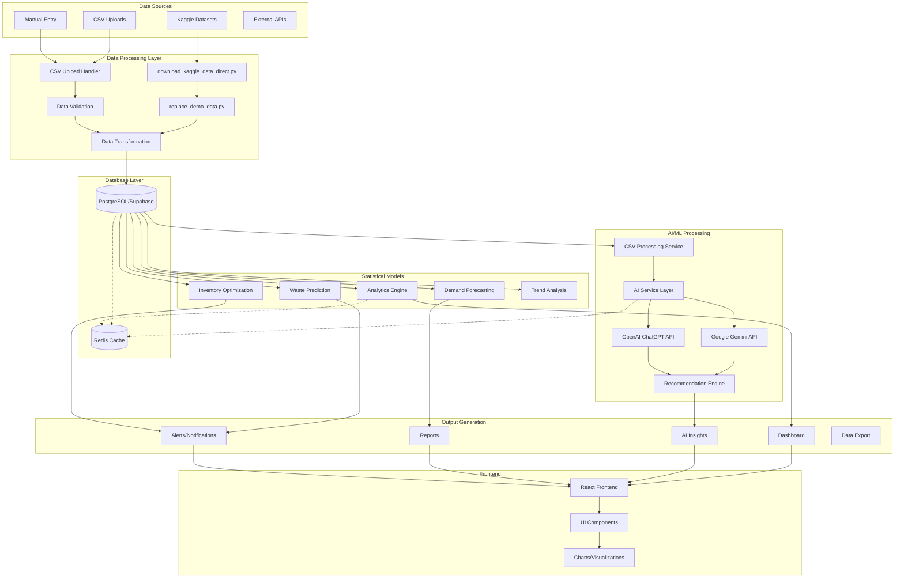

# Comprehensive Dataflow Diagram - WasteWise System

## Overview
This document provides a comprehensive dataflow diagram showing how data flows through the WasteWise system, from Kaggle data sources through statistical models to final outputs.

## System Architecture Dataflow



## Detailed Data Flow Descriptions

### 1. Data Ingestion Flow

#### Kaggle Data Integration
```
Kaggle Datasets → download_kaggle_data_direct.py → Sample Realistic Data → replace_demo_data.py → CSV Files
```

**Process:**
1. **Kaggle Dataset Download**: `download_kaggle_data_direct.py` creates realistic sample datasets
2. **Data Replacement**: `replace_demo_data.py` replaces demo data with realistic data
3. **File Structure**: Creates structured CSV files in `datasets/` directory

**Data Types:**
- Coffee shop sales data
- Customer profiles
- Product catalogs
- Waste tracking data
- Inventory levels
- POS transaction data

#### CSV Upload Flow
```
CSV Files → Upload Handler → Validation → Transformation → Database
```

**Process:**
1. **File Upload**: Users upload CSV files via frontend
2. **Validation**: Schema-based validation with error reporting
3. **Processing**: Data transformation and insertion
4. **AI Processing**: Automatic insights generation

### 2. Database Processing Flow

#### Data Storage
```
Processed Data → PostgreSQL/Supabase → Row Level Security → Structured Storage
```

**Tables:**
- `users` - User profiles and authentication
- `outlets` - Restaurant/coffee shop locations
- `inventory_data` - Current inventory levels
- `sales_pos_data` - Sales transactions
- `waste_logs` - Waste tracking records
- `suppliers` - Supplier information

#### Data Retrieval
```
Database → Caching Layer → API Endpoints → Frontend
```

**Optimization:**
- Redis caching for frequently accessed data
- Indexed queries for performance
- Connection pooling for scalability

### 3. AI/ML Processing Flow

#### CSV Processing Service
```
Uploaded Data → CSV Processing Service → Immediate Insights → AI Recommendations
```

**Features:**
- Real-time data analysis
- Pattern recognition
- Anomaly detection
- Trend identification

#### AI Service Layer
```
Database Data → AI Service → Gemini/ChatGPT → Structured Recommendations
```

**Process:**
1. **Data Fetching**: Retrieves relevant data for analysis
2. **Prompt Generation**: Creates context-specific prompts
3. **AI Processing**: Calls Gemini (primary) or ChatGPT (fallback)
4. **Response Processing**: Structures and formats recommendations

#### Statistical Models

##### Demand Forecasting
```
Historical Sales → Trend Analysis → Seasonal Patterns → Demand Predictions
```

##### Waste Prediction
```
Waste History → Pattern Recognition → Predictive Models → Waste Alerts
```

##### Inventory Optimization
```
Current Stock → Demand Forecast → Reorder Points → Optimization Recommendations
```

### 4. Output Generation Flow

#### Dashboard Data
```
Analytics Engine → Aggregated Metrics → Dashboard Components → Real-time Updates
```

**Metrics:**
- Total revenue and sales trends
- Waste reduction percentages
- Inventory turnover rates
- Customer satisfaction scores

#### AI Insights
```
Recommendation Engine → Contextual Analysis → Actionable Insights → User Interface
```

**Insight Types:**
- Waste reduction opportunities
- Inventory optimization suggestions
- Menu item performance analysis
- Staff training recommendations

#### Reports and Alerts
```
Statistical Models → Threshold Monitoring → Automated Alerts → Notification System
```

**Alert Types:**
- Low inventory warnings
- High waste alerts
- Sales performance notifications
- Compliance reminders

### 5. Frontend Integration Flow

#### React Components
```
Backend APIs → React Context → Component State → UI Rendering
```

**Components:**
- Dashboard with real-time metrics
- Interactive charts and visualizations
- AI recommendation displays
- Data upload interfaces

#### Real-time Updates
```
WebSocket Connections → State Management → Component Re-rendering → User Experience
```

## Data Transformation Pipeline

### 1. Kaggle Data to Application Data

#### Input Format
```csv
transaction_id,date,time,product_name,category,quantity,unit_price,total_amount,customer_id,outlet_id
TXN001,2024-01-15,08:30:00,Espresso,Coffee,1,3.50,3.50,CUST001,OUT001
```

#### Processing Steps
1. **Validation**: Check data types and required fields
2. **Normalization**: Standardize formats and values
3. **Enrichment**: Add derived fields and calculations
4. **Storage**: Insert into appropriate database tables

### 2. Database to Analytics

#### Data Aggregation
```sql
SELECT 
  DATE(transaction_date) as date,
  SUM(total_revenue) as daily_revenue,
  COUNT(*) as transaction_count,
  AVG(total_revenue) as avg_order_value
FROM sales_pos_data 
WHERE user_id = $1 
  AND transaction_date >= $2 
GROUP BY DATE(transaction_date)
ORDER BY date DESC;
```

#### Statistical Processing
- Moving averages for trend analysis
- Seasonal decomposition for forecasting
- Correlation analysis for pattern recognition
- Regression models for predictions

### 3. Analytics to AI Input

#### Data Preparation
```javascript
const analytics = {
  topSellingItems: await getTopSellingItems(),
  waste: await getWasteStats(),
  staffTraining: await getStaffTraining(),
  supplierRisk: await getSupplierRisk(),
  compliance: await getComplianceStats(),
  timestamp: new Date().toISOString()
};
```

#### Prompt Generation
```javascript
const prompt = `
Analyze the following coffee shop data and provide actionable recommendations:

Sales Performance: ${JSON.stringify(analytics.topSellingItems)}
Waste Analysis: ${JSON.stringify(analytics.waste)}
Staff Training Status: ${JSON.stringify(analytics.staffTraining)}
Supplier Risk Assessment: ${JSON.stringify(analytics.supplierRisk)}
Compliance Status: ${JSON.stringify(analytics.compliance)}

Provide specific, actionable recommendations for improving operations.
`;
```

## Performance Optimization

### 1. Caching Strategy
- **Redis Cache**: Frequently accessed analytics data
- **Browser Cache**: Static assets and API responses
- **Database Cache**: Query result caching

### 2. Data Processing Optimization
- **Batch Processing**: Efficient handling of large CSV uploads
- **Parallel Processing**: Concurrent AI API calls
- **Connection Pooling**: Database connection management

### 3. Real-time Updates
- **WebSocket Connections**: Live data streaming
- **Event-driven Architecture**: Reactive updates
- **Optimistic UI**: Immediate user feedback

## Security and Compliance

### 1. Data Security
- **Row Level Security**: User data isolation
- **Encryption**: Data at rest and in transit
- **Authentication**: JWT-based access control

### 2. Data Privacy
- **GDPR Compliance**: User data protection
- **Data Retention**: Automated cleanup policies
- **Audit Logging**: Comprehensive activity tracking

## Monitoring and Observability

### 1. Performance Monitoring
- **API Response Times**: Endpoint performance tracking
- **Database Performance**: Query optimization monitoring
- **AI Service Health**: API availability and response quality

### 2. Data Quality Monitoring
- **Validation Metrics**: Data quality scores
- **Anomaly Detection**: Unusual pattern identification
- **Completeness Checks**: Missing data monitoring

## Future Enhancements

### 1. Advanced Analytics
- **Machine Learning Models**: Predictive analytics
- **Real-time Streaming**: Live data processing
- **Advanced Visualizations**: Interactive dashboards

### 2. Integration Expansion
- **External Data Sources**: Third-party integrations
- **API Ecosystem**: Partner integrations
- **Mobile Applications**: Native mobile apps

---

**Document Version**: 1.0  
**Last Updated**: January 2025  
**Next Review**: February 2025


