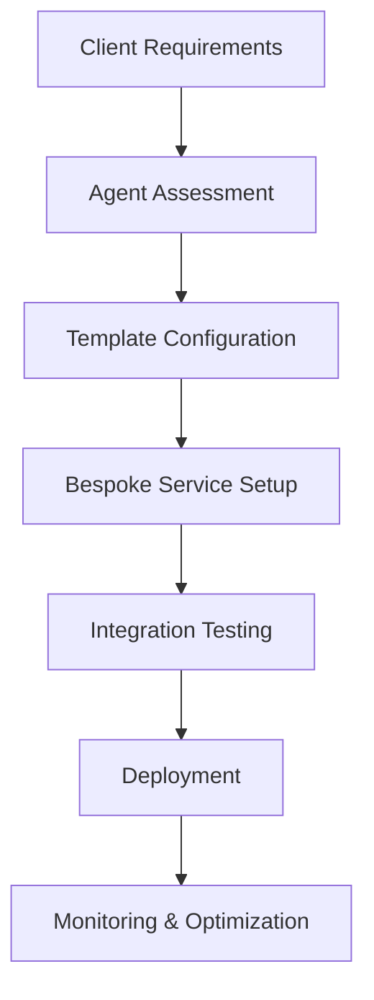

# WasteWise SaaS Template & Bespoke Services Integration Guide

## Document Information
- **Document Version**: 1.0
- **Last Updated**: December 2024
- **Document Owner**: Technical Architecture Team
- **Stakeholders**: AI Agents, Implementation Teams, Enterprise Clients, Professional Services
- **Related Documents**: 
  - [WasteWise SaaS Template PRD](./WASTEWISE_PRODUCT_REQUIREMENTS_DOCUMENT.md)
  - [Bespoke Services Specification](./BESPOKE_SERVICES_SPECIFICATION.md)

---

## 1. Integration Overview

### 1.1 Purpose
This guide provides comprehensive instructions for AI agents and implementation teams on how to seamlessly integrate bespoke services with the WasteWise SaaS template platform. It serves as a technical blueprint for extending template functionality while maintaining system integrity and user experience consistency.

### 1.2 Integration Philosophy
**Core Principle**: The WasteWise template serves as the foundation, with bespoke services extending capabilities through well-defined integration points without disrupting core functionality.

**Key Integration Principles:**
- **Non-Disruptive**: Bespoke services enhance rather than replace template functionality
- **Consistent UX**: All custom features maintain template design and interaction patterns
- **Data Integrity**: Seamless data flow between template and custom components
- **Scalable Architecture**: Integration points support future enhancements and scaling
- **Maintainable**: Clear separation of concerns between template and custom code

### 1.3 Target Audience
- **AI Agents**: Automated systems that need to configure and integrate bespoke services
- **Implementation Teams**: Technical teams deploying custom solutions
- **Enterprise Clients**: Organizations requiring bespoke integrations
- **Professional Services**: Teams delivering custom development and consulting

---

## 2. Template Architecture & Integration Points

### 2.1 Template Core Architecture

#### 2.1.1 Modular Design Structure
```
┌─────────────────────────────────────────────────────────────┐
│                    WasteWise Template Core                  │
├─────────────────────────────────────────────────────────────┤
│  ┌─────────────┐  ┌─────────────┐  ┌─────────────┐        │
│  │   Auth      │  │   Data      │  │   API       │        │
│  │  Engine     │  │  Engine     │  │  Gateway    │        │
│  └─────────────┘  └─────────────┘  └─────────────┘        │
├─────────────────────────────────────────────────────────────┤
│  ┌─────────────┐  ┌─────────────┐  ┌─────────────┐        │
│  │  Business   │  │   UI        │  │  Reporting  │        │
│  │   Logic     │  │  Framework  │  │   Engine    │        │
│  └─────────────┘  └─────────────┘  └─────────────┘        │
├─────────────────────────────────────────────────────────────┤
│  ┌─────────────┐  ┌─────────────┐  ┌─────────────┐        │
│  │  Plugin     │  │  Config     │  │  Webhook    │        │
│  │  System     │  │  Manager    │  │  System     │        │
│  └─────────────┘  └─────────────┘  └─────────────┘        │
└─────────────────────────────────────────────────────────────┘
```

#### 2.1.2 Integration Layer Components
- **Plugin System**: Modular architecture for custom feature deployment
- **Configuration Manager**: Dynamic configuration for client-specific settings
- **API Gateway**: Extensible API layer for custom integrations
- **Webhook System**: Event-driven integration for real-time data sync
- **Data Harmonization Layer**: Standardized data formats and validation

### 2.2 Integration Points

#### 2.2.1 Authentication Integration
**Template Authentication Flow:**
```
User Login → Template Auth → JWT Token → Bespoke Service Validation → Access Granted
```

**Integration Requirements:**
- **Single Sign-On (SSO)**: Unified authentication across template and bespoke services
- **Role-Based Access**: Consistent permission model across all components
- **Token Validation**: Secure token sharing between template and custom services
- **Session Management**: Unified session handling across all services

**Agent Configuration Steps:**
1. Configure SSO provider in template settings
2. Map bespoke service authentication to template user roles
3. Set up token validation endpoints in bespoke services
4. Test authentication flow end-to-end

#### 2.2.2 Data Integration
**Template Data Schema:**
```json
{
  "waste_tracking": {
    "id": "uuid",
    "location_id": "uuid",
    "category": "string",
    "quantity": "decimal",
    "cost": "decimal",
    "timestamp": "datetime",
    "custom_fields": "object"
  },
  "inventory": {
    "id": "uuid",
    "location_id": "uuid",
    "item_name": "string",
    "current_stock": "decimal",
    "reorder_point": "decimal",
    "custom_fields": "object"
  }
}
```

**Integration Requirements:**
- **Schema Compliance**: Bespoke services must comply with template data schemas
- **Data Validation**: All data must pass template validation rules
- **Custom Fields**: Support for additional fields through extensible schema
- **Data Synchronization**: Real-time or batch synchronization as required

**Agent Configuration Steps:**
1. Map bespoke data schemas to template schemas
2. Configure data transformation rules
3. Set up data validation pipelines
4. Implement synchronization mechanisms
5. Test data integrity and consistency

#### 2.2.3 API Integration
**Template API Standards:**
```
Base URL: https://api.wastewise.com/v1
Authentication: Bearer Token
Content-Type: application/json
Rate Limiting: 1000 requests/hour per client
```

**Integration Requirements:**
- **API Compliance**: Bespoke services must follow template API standards
- **Versioning**: Support for API versioning and backward compatibility
- **Rate Limiting**: Respect template rate limiting policies
- **Error Handling**: Consistent error response formats
- **Documentation**: Complete API documentation for all endpoints

**Agent Configuration Steps:**
1. Review template API documentation and standards
2. Configure bespoke services to use template API formats
3. Implement rate limiting and error handling
4. Set up API monitoring and logging
5. Create comprehensive API documentation

---

## 3. Agent Configuration Framework

### 3.1 Configuration Management System

#### 3.1.1 Template Configuration Schema
```json
{
  "client_config": {
    "client_id": "string",
    "client_name": "string",
    "template_version": "string",
    "bespoke_features": ["array"],
    "integration_settings": {
      "auth": "object",
      "data": "object",
      "ui": "object",
      "api": "object"
    }
  },
  "feature_flags": {
    "custom_analytics": "boolean",
    "legacy_integration": "boolean",
    "advanced_reporting": "boolean",
    "custom_workflows": "boolean"
  },
  "bespoke_services": {
    "service_name": {
      "enabled": "boolean",
      "endpoint": "string",
      "config": "object"
    }
  }
}
```

#### 3.1.2 Agent Configuration Process
**Step 1: Assessment**
```javascript
// Agent assessment function
async function assessClientRequirements(clientData) {
  const requirements = {
    template_features: analyzeTemplateFeatures(clientData),
    bespoke_needs: identifyBespokeRequirements(clientData),
    integration_points: mapIntegrationPoints(clientData),
    configuration_needs: determineConfigurationNeeds(clientData)
  };
  return requirements;
}
```

**Step 2: Configuration Generation**
```javascript
// Agent configuration generation
async function generateConfiguration(requirements) {
  const config = {
    client_config: createClientConfig(requirements),
    feature_flags: setFeatureFlags(requirements),
    bespoke_services: configureBespokeServices(requirements),
    integration_settings: setupIntegrationSettings(requirements)
  };
  return config;
}
```

**Step 3: Validation**
```javascript
// Agent configuration validation
async function validateConfiguration(config) {
  const validation = {
    schema_compliance: validateSchema(config),
    integration_tests: runIntegrationTests(config),
    security_checks: performSecurityChecks(config),
    performance_tests: runPerformanceTests(config)
  };
  return validation;
}
```

### 3.2 Automated Integration Workflows

#### 3.2.1 Template Customization Workflow


#### 3.2.2 Agent Implementation Steps
**Phase 1: Template Configuration**
1. **Client Analysis**: Analyze client requirements and existing systems
2. **Template Setup**: Configure template settings and feature flags
3. **Data Mapping**: Map client data to template schemas
4. **Authentication Setup**: Configure SSO and user management
5. **UI Customization**: Apply client branding and custom UI elements

**Phase 2: Bespoke Service Integration**
1. **Service Deployment**: Deploy bespoke services with template compatibility
2. **API Integration**: Configure API endpoints and data exchange
3. **Database Integration**: Set up data synchronization and validation
4. **Authentication Integration**: Implement unified authentication
5. **UI Integration**: Integrate custom features into template interface

**Phase 3: Testing & Validation**
1. **Unit Testing**: Test individual components and integrations
2. **Integration Testing**: Test end-to-end workflows
3. **Performance Testing**: Validate performance requirements
4. **Security Testing**: Verify security and compliance
5. **User Acceptance Testing**: Validate with client users

**Phase 4: Deployment & Monitoring**
1. **Production Deployment**: Deploy to production environment
2. **Monitoring Setup**: Configure monitoring and alerting
3. **Performance Optimization**: Optimize based on real-world usage
4. **User Training**: Provide training and documentation
5. **Ongoing Support**: Establish support and maintenance procedures

---

## 4. Specific Integration Patterns

### 4.1 Legacy System Integration

#### 4.1.1 ERP System Integration
**Integration Pattern**: API Gateway → Data Transformation → Template Database

**Agent Configuration:**
```javascript
const erpIntegration = {
  service_name: "erp_integration",
  endpoint: "https://bespoke-api.wastewise.com/erp",
  config: {
    source_system: "SAP",
    data_mapping: {
      inventory: {
        sap_item_code: "template.item_name",
        sap_quantity: "template.current_stock",
        sap_unit: "template.unit"
      },
      waste: {
        sap_waste_code: "template.category",
        sap_waste_qty: "template.quantity",
        sap_waste_cost: "template.cost"
      }
    },
    sync_schedule: "every_15_minutes",
    error_handling: "retry_with_backoff"
  }
};
```

**Implementation Steps:**
1. **API Gateway Setup**: Configure API gateway for ERP communication
2. **Data Transformation**: Implement data mapping and transformation
3. **Authentication**: Set up secure authentication with ERP system
4. **Error Handling**: Implement robust error handling and retry logic
5. **Monitoring**: Set up monitoring and alerting for integration health

#### 4.1.2 POS System Integration
**Integration Pattern**: Real-time Webhook → Data Processing → Template Update

**Agent Configuration:**
```javascript
const posIntegration = {
  service_name: "pos_integration",
  endpoint: "https://bespoke-api.wastewise.com/pos",
  config: {
    source_systems: ["Square", "Toast", "Clover"],
    real_time_sync: true,
    data_processing: {
      sales_data: {
        transform: "normalize_sales_format",
        validate: "check_data_integrity",
        enrich: "add_location_context"
      }
    },
    webhook_config: {
      endpoint: "/webhooks/pos-update",
      authentication: "hmac_signature",
      retry_policy: "exponential_backoff"
    }
  }
};
```

### 4.2 Advanced Analytics Integration

#### 4.2.1 Custom ML Model Integration
**Integration Pattern**: Data Pipeline → ML Processing → Template Dashboard

**Agent Configuration:**
```javascript
const mlAnalytics = {
  service_name: "custom_ml_analytics",
  endpoint: "https://bespoke-api.wastewise.com/ml",
  config: {
    models: {
      demand_forecasting: {
        type: "time_series",
        input_features: ["historical_sales", "weather", "events"],
        output_format: "template.forecast_schema",
        update_frequency: "daily"
      },
      menu_optimization: {
        type: "recommendation",
        input_features: ["sales_data", "waste_data", "cost_data"],
        output_format: "template.recommendation_schema",
        update_frequency: "weekly"
      }
    },
    data_pipeline: {
      source: "template.database",
      processing: "spark_cluster",
      storage: "template.data_warehouse",
      api_endpoint: "/api/ml/predictions"
    }
  }
};
```

### 4.3 Custom UI Component Integration

#### 4.3.1 Dashboard Widget Integration
**Integration Pattern**: Custom Component → Template UI Framework → Unified Dashboard

**Agent Configuration:**
```javascript
const customDashboard = {
  service_name: "custom_dashboard_widgets",
  config: {
    widgets: [
      {
        id: "custom_kpi_widget",
        component: "CustomKPIDashboard",
        position: "main_dashboard",
        data_source: "bespoke_analytics_api",
        refresh_interval: "5_minutes"
      },
      {
        id: "legacy_system_status",
        component: "LegacySystemStatus",
        position: "operations_panel",
        data_source: "legacy_system_health_api",
        refresh_interval: "1_minute"
      }
    ],
    ui_integration: {
      theme: "template_theme",
      responsive: true,
      accessibility: "wcag_2_1_aa"
    }
  }
};
```

---

## 5. Testing & Validation Framework

### 5.1 Integration Testing Suite

#### 5.1.1 Automated Testing Framework
```javascript
// Integration test suite for agents
class IntegrationTestSuite {
  async runTemplateBespokeIntegrationTests(config) {
    const tests = [
      this.testAuthenticationFlow(config),
      this.testDataSynchronization(config),
      this.testAPIIntegration(config),
      this.testUIComponents(config),
      this.testPerformance(config),
      this.testSecurity(config)
    ];
    
    const results = await Promise.all(tests);
    return this.aggregateResults(results);
  }
  
  async testAuthenticationFlow(config) {
    // Test SSO integration
    // Test token validation
    // Test role-based access
    // Test session management
  }
  
  async testDataSynchronization(config) {
    // Test data transformation
    // Test schema compliance
    // Test real-time sync
    // Test error handling
  }
}
```

#### 5.1.2 Performance Testing
```javascript
// Performance testing for bespoke integrations
const performanceTests = {
  load_testing: {
    concurrent_users: 1000,
    test_duration: "1_hour",
    target_response_time: "<2_seconds",
    error_rate_threshold: "<0.1%"
  },
  stress_testing: {
    peak_load: 2000,
    ramp_up_time: "5_minutes",
    sustain_duration: "30_minutes",
    recovery_time: "<5_minutes"
  }
};
```

### 5.2 Security Validation

#### 5.2.1 Security Testing Checklist
- **Authentication Security**: Validate SSO implementation and token security
- **Data Encryption**: Verify encryption in transit and at rest
- **API Security**: Test API authentication, authorization, and rate limiting
- **Input Validation**: Validate all input sanitization and validation
- **Access Control**: Test role-based access control and permissions
- **Audit Logging**: Verify comprehensive audit logging and monitoring

---

## 6. Monitoring & Maintenance

### 6.1 Integration Monitoring

#### 6.1.1 Health Monitoring
```javascript
// Monitoring configuration for agents
const monitoringConfig = {
  health_checks: {
    template_services: {
      endpoint: "/health",
      interval: "30_seconds",
      timeout: "5_seconds"
    },
    bespoke_services: {
      endpoint: "/health",
      interval: "30_seconds",
      timeout: "5_seconds"
    },
    integration_points: {
      endpoint: "/health/integration",
      interval: "1_minute",
      timeout: "10_seconds"
    }
  },
  alerting: {
    error_rate_threshold: "5%",
    response_time_threshold: "5_seconds",
    availability_threshold: "99.5%",
    notification_channels: ["email", "slack", "pagerduty"]
  }
};
```

#### 6.1.2 Performance Monitoring
- **Response Times**: Monitor API response times across all integration points
- **Throughput**: Track request volume and data processing rates
- **Error Rates**: Monitor error rates and failure patterns
- **Resource Usage**: Track CPU, memory, and storage utilization
- **Data Quality**: Monitor data integrity and validation failures

### 6.2 Maintenance Procedures

#### 6.2.1 Regular Maintenance Tasks
**Daily Tasks:**
- Health check validation
- Error log review
- Performance metrics analysis
- Security log review

**Weekly Tasks:**
- Integration performance optimization
- Data quality assessment
- Security vulnerability scanning
- Backup validation

**Monthly Tasks:**
- Comprehensive integration testing
- Performance benchmarking
- Security audit
- Documentation updates

---

## 7. Troubleshooting Guide

### 7.1 Common Integration Issues

#### 7.1.1 Authentication Issues
**Problem**: SSO integration failures
**Symptoms**: Users cannot access bespoke features
**Solutions**:
1. Verify SSO provider configuration
2. Check token validation endpoints
3. Validate user role mappings
4. Test authentication flow end-to-end

#### 7.1.2 Data Synchronization Issues
**Problem**: Data inconsistencies between template and bespoke services
**Symptoms**: Outdated or missing data in custom features
**Solutions**:
1. Check data transformation rules
2. Validate schema compliance
3. Review synchronization schedules
4. Test data integrity checks

#### 7.1.3 Performance Issues
**Problem**: Slow response times for integrated features
**Symptoms**: User complaints about slow loading times
**Solutions**:
1. Optimize API endpoints
2. Implement caching strategies
3. Review database queries
4. Scale infrastructure resources

### 7.2 Agent Troubleshooting Commands

#### 7.2.1 Diagnostic Commands
```bash
# Check integration health
curl -X GET https://api.wastewise.com/health/integration

# Test authentication flow
curl -X POST https://api.wastewise.com/auth/test \
  -H "Authorization: Bearer $TOKEN"

# Validate data synchronization
curl -X GET https://api.wastewise.com/data/sync/status

# Check performance metrics
curl -X GET https://api.wastewise.com/metrics/performance
```

---

## 8. Best Practices

### 8.1 Development Best Practices

#### 8.1.1 Code Organization
- **Separation of Concerns**: Keep template and bespoke code clearly separated
- **Modular Design**: Use modular architecture for easy maintenance
- **Documentation**: Maintain comprehensive documentation for all custom code
- **Version Control**: Use proper version control for all custom components
- **Testing**: Implement comprehensive testing for all integrations

#### 8.1.2 Security Best Practices
- **Principle of Least Privilege**: Grant minimum necessary permissions
- **Input Validation**: Validate all inputs from external sources
- **Secure Communication**: Use HTTPS and proper authentication
- **Regular Updates**: Keep all components updated with security patches
- **Audit Logging**: Implement comprehensive audit logging

### 8.2 Operational Best Practices

#### 8.2.1 Deployment Practices
- **Blue-Green Deployment**: Use blue-green deployment for zero downtime
- **Rollback Procedures**: Have clear rollback procedures for failed deployments
- **Environment Parity**: Maintain consistency across environments
- **Configuration Management**: Use proper configuration management
- **Monitoring**: Implement comprehensive monitoring from day one

#### 8.2.2 Maintenance Practices
- **Regular Updates**: Keep all components updated regularly
- **Performance Monitoring**: Continuously monitor performance metrics
- **Capacity Planning**: Plan for future capacity requirements
- **Disaster Recovery**: Have comprehensive disaster recovery procedures
- **Documentation**: Keep documentation updated and accessible

---

## 9. Conclusion

This integration guide provides a comprehensive framework for AI agents and implementation teams to seamlessly integrate bespoke services with the WasteWise SaaS template platform. By following the patterns, procedures, and best practices outlined in this guide, teams can ensure successful integration while maintaining system integrity, performance, and user experience.

Key success factors for integration:
1. **Thorough Planning**: Complete assessment and planning before implementation
2. **Proper Configuration**: Correct configuration of all integration points
3. **Comprehensive Testing**: Thorough testing of all integration components
4. **Continuous Monitoring**: Ongoing monitoring and optimization
5. **Clear Documentation**: Complete documentation for maintenance and support

The integration framework is designed to be flexible and extensible, supporting a wide range of bespoke service requirements while maintaining the reliability and performance of the core template platform.

---

**Document Status**: ✅ Complete  
**Next Review**: March 2025  
**Approved By**: [To be filled]  
**Document Owner**: Technical Architecture Team
