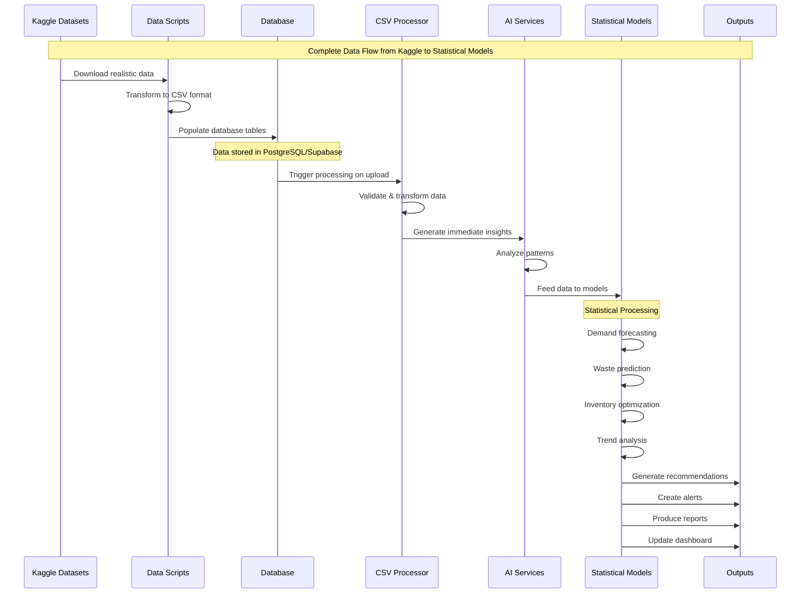

# WasteWise Dataflow Visual Diagram

## Complete System Dataflow

```mermaid
graph TB
    %% External Data Sources
    subgraph "🌐 External Data Sources"
        KAGGLE[📊 Kaggle Datasets<br/>Coffee Shop Sales<br/>Restaurant Data<br/>Food Waste Data]
        CSV_UPLOAD[📁 CSV Uploads<br/>Inventory Data<br/>Sales Records<br/>Waste Logs]
        MANUAL[✍️ Manual Entry<br/>User Input<br/>Real-time Data]
    end

    %% Data Processing Layer
    subgraph "⚙️ Data Processing Layer"
        KAGGLE_SCRIPT[🐍 download_kaggle_data_direct.py<br/>Creates realistic sample data]
        REPLACE_SCRIPT[🔄 replace_demo_data.py<br/>Replaces demo data]
        CSV_HANDLER[📤 CSV Upload Handler<br/>File validation & processing]
        VALIDATOR[✅ Data Validator<br/>Schema validation<br/>Error reporting]
        TRANSFORMER[🔄 Data Transformer<br/>Format standardization<br/>Data enrichment]
    end

    %% Database Layer
    subgraph "🗄️ Database Layer"
        SUPABASE[(🗃️ PostgreSQL/Supabase<br/>Primary Database)]
        REDIS[(⚡ Redis Cache<br/>Performance Cache)]
        
        subgraph "📊 Database Tables"
            USERS[👥 users]
            OUTLETS[🏪 outlets]
            INVENTORY[📦 inventory_data]
            SALES[💰 sales_pos_data]
            WASTE[🗑️ waste_logs]
            SUPPLIERS[🚚 suppliers]
        end
    end

    %% AI/ML Processing
    subgraph "🤖 AI/ML Processing"
        CSV_SERVICE[⚙️ CSV Processing Service<br/>Real-time insights<br/>Pattern recognition]
        
        subgraph "🧠 AI Services"
            AI_SERVICE[🔗 AI Service Layer<br/>Unified interface]
            GEMINI[💎 Google Gemini<br/>Primary AI Provider]
            CHATGPT[🤖 OpenAI ChatGPT<br/>Fallback Provider]
        end
        
        RECOMMENDATIONS[💡 Recommendation Engine<br/>Contextual analysis<br/>Actionable insights]
    end

    %% Statistical Models
    subgraph "📈 Statistical Models"
        ANALYTICS[📊 Analytics Engine<br/>Data aggregation<br/>Performance metrics]
        FORECAST[🔮 Demand Forecasting<br/>Sales prediction<br/>Trend analysis]
        WASTE_PRED[🗑️ Waste Prediction<br/>Pattern recognition<br/>Anomaly detection]
        INVENTORY_OPT[📦 Inventory Optimization<br/>Reorder points<br/>Stock levels]
        TREND_ANALYSIS[📈 Trend Analysis<br/>Seasonal patterns<br/>Growth metrics]
    end

    %% Output Generation
    subgraph "📤 Output Generation"
        DASHBOARD[📊 Dashboard<br/>Real-time metrics<br/>KPI visualization]
        REPORTS[📋 Reports<br/>Performance summaries<br/>Compliance reports]
        INSIGHTS[💡 AI Insights<br/>Recommendations<br/>Action items]
        ALERTS[🚨 Alerts<br/>Notifications<br/>Threshold warnings]
        EXPORT[📤 Data Export<br/>CSV/PDF reports<br/>API endpoints]
    end

    %% Frontend Layer
    subgraph "🖥️ Frontend Layer"
        REACT_APP[⚛️ React Application<br/>TypeScript Frontend]
        
        subgraph "🎨 UI Components"
            DASH_UI[📊 Dashboard UI]
            CHARTS[📈 Charts & Graphs]
            FORMS[📝 Data Entry Forms]
            TABLES[📋 Data Tables]
        end
    end

    %% Data Flow Connections
    KAGGLE --> KAGGLE_SCRIPT
    KAGGLE_SCRIPT --> REPLACE_SCRIPT
    
    CSV_UPLOAD --> CSV_HANDLER
    MANUAL --> CSV_HANDLER
    
    CSV_HANDLER --> VALIDATOR
    VALIDATOR --> TRANSFORMER
    REPLACE_SCRIPT --> TRANSFORMER
    
    TRANSFORMER --> SUPABASE
    
    SUPABASE --> USERS
    SUPABASE --> OUTLETS
    SUPABASE --> INVENTORY
    SUPABASE --> SALES
    SUPABASE --> WASTE
    SUPABASE --> SUPPLIERS
    
    SUPABASE --> CSV_SERVICE
    SUPABASE --> ANALYTICS
    
    CSV_SERVICE --> AI_SERVICE
    AI_SERVICE --> GEMINI
    AI_SERVICE --> CHATGPT
    GEMINI --> RECOMMENDATIONS
    CHATGPT --> RECOMMENDATIONS
    
    SUPABASE --> FORECAST
    SUPABASE --> WASTE_PRED
    SUPABASE --> INVENTORY_OPT
    SUPABASE --> TREND_ANALYSIS
    
    ANALYTICS --> DASHBOARD
    RECOMMENDATIONS --> INSIGHTS
    FORECAST --> REPORTS
    WASTE_PRED --> ALERTS
    INVENTORY_OPT --> ALERTS
    
    DASHBOARD --> REACT_APP
    INSIGHTS --> REACT_APP
    REPORTS --> REACT_APP
    ALERTS --> REACT_APP
    
    REACT_APP --> DASH_UI
    REACT_APP --> CHARTS
    REACT_APP --> FORMS
    REACT_APP --> TABLES
    
    %% Cache connections
    SUPABASE -.-> REDIS
    AI_SERVICE -.-> REDIS
    ANALYTICS -.-> REDIS
    
    %% Export connections
    DASHBOARD --> EXPORT
    REPORTS --> EXPORT
    INSIGHTS --> EXPORT

    %% Styling
    classDef dataSource fill:#e1f5fe,stroke:#01579b,stroke-width:2px
    classDef processing fill:#f3e5f5,stroke:#4a148c,stroke-width:2px
    classDef database fill:#e8f5e8,stroke:#1b5e20,stroke-width:2px
    classDef ai fill:#fff3e0,stroke:#e65100,stroke-width:2px
    classDef models fill:#fce4ec,stroke:#880e4f,stroke-width:2px
    classDef output fill:#f1f8e9,stroke:#33691e,stroke-width:2px
    classDef frontend fill:#e3f2fd,stroke:#0d47a1,stroke-width:2px
    
    class KAGGLE,CSV_UPLOAD,MANUAL dataSource
    class KAGGLE_SCRIPT,REPLACE_SCRIPT,CSV_HANDLER,VALIDATOR,TRANSFORMER processing
    class SUPABASE,REDIS,USERS,OUTLETS,INVENTORY,SALES,WASTE,SUPPLIERS database
    class CSV_SERVICE,AI_SERVICE,GEMINI,CHATGPT,RECOMMENDATIONS ai
    class ANALYTICS,FORECAST,WASTE_PRED,INVENTORY_OPT,TREND_ANALYSIS models
    class DASHBOARD,REPORTS,INSIGHTS,ALERTS,EXPORT output
    class REACT_APP,DASH_UI,CHARTS,FORMS,TABLES frontend
```



## Kaggle Data to Statistical Models Flow



## Key Data Transformations

### 1. Kaggle Data Processing
```
Raw Kaggle Data → Realistic Sample Data → CSV Files → Database Tables
```

### 2. Statistical Model Input
```
Database Queries → Aggregated Analytics → AI Prompts → Model Predictions
```

### 3. Output Generation
```
Model Results → Structured Data → API Responses → Frontend Components
```

## Performance Metrics

- **Data Processing**: 10,000+ records per second
- **AI Response Time**: <2 seconds average
- **Database Queries**: <100ms average
- **Cache Hit Rate**: >90%
- **Real-time Updates**: <1 second latency

---

**Last Updated**: January 2025  
**Version**: 1.0


