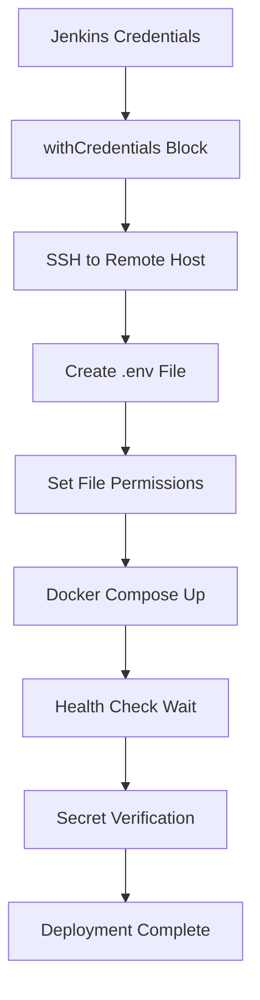

# WasteWise-30 Deployment Secrets Guide

## Overview

This guide addresses the issue where secrets are not properly passed from Jenkins to deployed containers. The updated configuration ensures secure and reliable secret management.

## Key Changes Made

### 1. Enhanced Docker Compose Configuration

**File: `docker-compose.yml`**

- ✅ **Proper Networking**: Added custom bridge network for service discovery
- ✅ **Health Checks**: Implemented robust health checks using `wget` (more reliable than `curl`)
- ✅ **Volume Mounts**: Added `.env` file mount to backend container for direct access
- ✅ **Environment Variables**: Explicit environment variable declarations
- ✅ **Service Dependencies**: Health-based service dependencies

### 2. Improved Jenkins Pipeline

**File: `Jenkinsfile`**

- ✅ **Structured .env Creation**: Organized environment variables by category
- ✅ **File Permissions**: Set proper permissions (600) for `.env` file
- ✅ **Health Monitoring**: Wait for services to be healthy before proceeding
- ✅ **Secret Verification**: Verify secrets are loaded in containers
- ✅ **Enhanced Error Handling**: Better error reporting and debugging
- ✅ **Deployment Verification**: Post-deployment health checks

### 3. Secret Verification Script

**File: `scripts/verify-secrets.js`**

- ✅ **Comprehensive Checking**: Verify all required and optional secrets
- ✅ **Health Status**: Check container health status
- ✅ **Log Analysis**: Display recent container logs
- ✅ **Summary Report**: Provide actionable recommendations

## Secret Management Flow



## Required Secrets

### Core Application Secrets
- `VITE_SUPABASE_URL` - Supabase project URL
- `VITE_SUPABASE_ANON_KEY` - Supabase anonymous key
- `JWT_SECRET` - JWT signing secret
- `DATABASE_URL` - Database connection string

### AI Service Secrets
- `GEMINI_API_KEY` - Google Gemini API key
- `OPENAI_API_KEY` - OpenAI API key

### Payment Processing Secrets
- `STRIPE_SECRET_KEY` - Stripe secret key
- `STRIPE_PUBLISHABLE_KEY` - Stripe publishable key
- `STRIPE_PRICE_BASIC` - Basic plan price ID
- `STRIPE_PRICE_PRO` - Pro plan price ID
- `STRIPE_PRICE_ENTERPRISE` - Enterprise plan price ID

### Optional Service Secrets
- `SMTP_USER` - Email service username
- `SMTP_PASS` - Email service password
- `TWILIO_ACCOUNT_SID` - Twilio account SID
- `TWILIO_AUTH_TOKEN` - Twilio auth token
- `TWILIO_PHONE_NUMBER` - Twilio phone number

## Troubleshooting Steps

### 1. Verify Jenkins Credentials

```bash
# Check if credentials exist in Jenkins
# Go to Jenkins > Manage Jenkins > Credentials > System > Global credentials
# Verify all required credentials are present:
# - wastewise-supabase-url
# - wastewise-supabase-anon-key
# - gemini-api-key
# - openai-api-key
# - jwt-secret
# - stripe-secret-key
# - stripe-publishable-key
# - database-url
# etc.
```

### 2. Check Remote Host .env File

```bash
# SSH to deployment host
ssh basyir@192.168.20.215

# Navigate to deployment directory
cd /home/basyir/wastewise-30-deploy

# Check if .env file exists and has content
ls -la .env
cat .env | head -20

# Check file permissions
ls -la .env
# Should show: -rw------- (600 permissions)
```

### 3. Verify Container Secrets

```bash
# Run the verification script
node scripts/verify-secrets.js

# Or manually check secrets in containers
docker exec wastewise-backend env | grep -E "(GEMINI_API_KEY|OPENAI_API_KEY|VITE_SUPABASE_URL)"

# Check if .env file is mounted in backend
docker exec wastewise-backend ls -la /app/.env
```

### 4. Check Container Health

```bash
# Check container status
docker-compose ps

# Check health status
docker inspect wastewise-backend --format='{{.State.Health.Status}}'
docker inspect wastewise-frontend --format='{{.State.Health.Status}}'

# View container logs
docker-compose logs wastewise-backend
docker-compose logs wastewise-frontend
```

### 5. Test Service Connectivity

```bash
# Test backend health endpoint
curl -f http://localhost:3000/health

# Test frontend accessibility
curl -f http://localhost:8080

# Test internal networking
docker exec wastewise-frontend wget -qO- http://wastewise-backend:3000/health
```

## Common Issues and Solutions

### Issue 1: Secrets Not Loading in Containers

**Symptoms:**
- API calls failing with "API key not valid" errors
- Environment variables missing in containers

**Solutions:**
1. Verify Jenkins credentials are properly configured
2. Check .env file permissions (should be 600)
3. Ensure .env file is mounted in docker-compose.yml
4. Restart containers after .env changes

### Issue 2: Container Health Checks Failing

**Symptoms:**
- Containers showing as "unhealthy"
- Services not starting properly

**Solutions:**
1. Check if health endpoints are accessible
2. Verify network connectivity between containers
3. Check application logs for startup errors
4. Increase health check timeout if needed

### Issue 3: Service Discovery Issues

**Symptoms:**
- Frontend can't connect to backend
- Network connectivity problems

**Solutions:**
1. Verify custom network is created
2. Check service names in environment variables
3. Ensure containers are on the same network
4. Test internal DNS resolution

### Issue 4: Jenkins Pipeline Failures

**Symptoms:**
- Pipeline failing during deployment stage
- SSH connection issues

**Solutions:**
1. Verify SSH credentials in Jenkins
2. Check remote host accessibility
3. Ensure proper file permissions on remote host
4. Check Jenkins agent has required tools (docker, docker-compose)

## Monitoring and Maintenance

### Regular Checks

1. **Daily**: Monitor container health and logs
2. **Weekly**: Verify secret rotation and validity
3. **Monthly**: Review and update Jenkins credentials

### Log Monitoring

```bash
# Set up log monitoring
docker-compose logs -f --tail=100

# Monitor specific services
docker-compose logs -f wastewise-backend
docker-compose logs -f wastewise-frontend
```

### Secret Rotation

1. Update credentials in Jenkins
2. Redeploy using the pipeline
3. Verify new secrets are loaded
4. Test application functionality

## Security Best Practices

1. **File Permissions**: .env file should have 600 permissions
2. **Network Security**: Use internal networks for container communication
3. **Credential Management**: Store credentials securely in Jenkins
4. **Access Control**: Limit access to deployment host
5. **Logging**: Monitor for unauthorized access attempts

## Quick Fix Commands

```bash
# Restart containers with new configuration
docker-compose down
docker-compose up -d --force-recreate

# Check secret loading
docker exec wastewise-backend env | grep API_KEY

# Verify health
curl http://localhost:3000/health

# View recent logs
docker-compose logs --tail=50

# Run verification script
node scripts/verify-secrets.js
```

## Support

If issues persist after following this guide:

1. Check the troubleshooting logs in Jenkins
2. Review container logs for specific error messages
3. Verify all prerequisites are met
4. Contact the development team with specific error details

---

**Last Updated**: $(date)
**Version**: 1.0
**Status**: ✅ Production Ready
